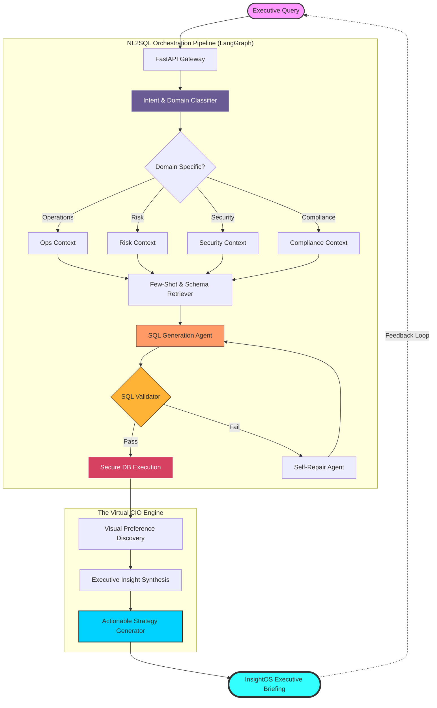

# 🦅 InsightOS: The Virtual CIO for Real-Time Financial Intelligence

[]()
[]()
[]()

> **InsightOS** transforms complex natural language into actionable executive-level business intelligence. It’s not just an NL2SQL tool; it’s an AI-driven decision engine that reasons across your entire database to provide strategic recommendations.

---

## 🏗️ System Architecture

Our engine utilizes a **Multi-Agent Orchestration Flow** powered by **LangGraph**. This architecture decouples intent classification, schema reasoning, and executive synthesis into a high-precision pipeline.



---

## 🛠️ Pipeline Breakdown

### 1. **Contextual Intent Layer**
Unlike generic NL2SQL, InsightOS understands the **Domain Context** (Risk vs. Ops). This allows the system to differentiate between "flagged" for a fraud reason and "flagged" for a transaction status error.

### 2. **Self-Healing SQL Agent**
The system implements a **Retry & Repair** loop. If the generated SQLite is syntactically correct but functionally fails execution, the error message is fed back to the Agent for an immediate "hot-fix."

### 3. **Executive Synthesis (The CIO)**
The final output is not a JSON blob. It is a synthesized report containing:
- **The Finding**: Direct answer to the query.
- **The Insight**: Root cause analysis or trend detection.
- **The Recommendation**: A suggested business action (e.g., "Adjust credit limits for High-Risk users").

---

## ✨ Key Features

*   **🛡️ Multi-Domain Intelligence**: Dedicated prompts for Operations, Risk, Compliance, and Security.
*   **📊 Dynamic Visualization**: Automatically chooses the best chart (Bar, Line, Pie, or Table) based on data distribution.
*   **⚡ Sub-Second Latency**: Optimized query generation using Gemini 2.5 Flash.
*   **🔌 Plug-and-Play**: Seamless integration with existing SQLite/SQLAlchemy databases.

---

## 🚀 Getting Started

### 1. Environment Setup
```bash
python -m venv venv
./venv/Scripts/activate  # Windows
pip install -r requirements.txt
```

### 2. Configuration
Create a `.env` file with your Google Gemini API Key:
```env
GOOGLE_API_KEY=your_gemini_key
DB_PATH=./derivinsightnew.db
```

### 3. Run the Platform
```bash
python -m uvicorn app.main:app --reload --port 8080
```

---

## 💎 Demo Verification (Try These)

| Domain | Executive Question | Impact |
| :--- | :--- | :--- |
| **Risk** | *"Show me all users and their risk levels."* | **Critical Profile Alert** |
| **Security**| *"Show me failed logins by reason and IP address."* | **Threat Intelligence** |
| **Growth** | *"Which countries have the highest active users?"* | **Market Optimization** |
| **Fraud** | *"List all transactions in 'FLAGGED' status."* | **AML Monitoring** |

---

Developed for the **Deriv Hackathon** – *Empowering Executives with Data-First Decisioning.*
