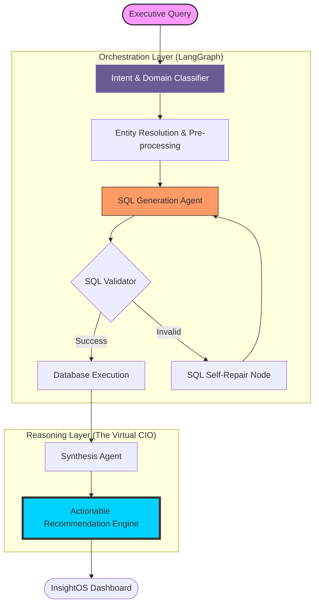

# 🦅 InsightOS: The Virtual CIO for Real-Time Financial Intelligence

[]()
[]()
[]()

> **InsightOS** transforms complex natural language into actionable executive-level business intelligence. It’s not just an NL2SQL tool; it’s an AI-driven decision engine that reasons across your entire database to provide strategic recommendations.

---

## 🏗️ System Architecture

Our architecture leverages a state-of-the-art **multi-agent orchestration** flow, ensuring every query is classified, validated, and synthesized with "CIO-level" reasoning.



---

## ✨ Key Features

### 🧠 Strategic Synthesis (CIO Reasoning)
Unlike standard query tools, InsightOS doesn't just return tables. It analyzes trends and provides two-step actionable advice for every result.
*   *Example:* "We detected a 25% failure rate in Japanese logins. **Recommendation:** Audit the Tokyo gateway and implement adaptive MFA."

### 🛡️ Multi-Domain Expertise
InsightOS has specialized intelligence nodes for:
*   **Operations:** Transaction volumes, volumes-by-country, and payment method efficiency.
*   **Risk:** Real-time identification of 'Critical' and 'High' risk user profiles.
*   **Compliance:** PEP tracking, AML alerts, and Sanctions matching.
*   **Security:** Failed login patterns and brute-force detection.

### ⚡ Self-Healing SQL Pipeline
High-precision SQL generation powered by Gemini with a feedback loop that automatically repairs queries if execution fails.

---

## 🚀 Getting Started

### 1. Prerequisite Setup
```bash
python -m venv venv
./venv/Scripts/activate  # Windows
pip install -r requirements.txt
```

### 2. Environment Variables
Create a `.env` file with your credentials:
```env
GOOGLE_API_KEY=your_gemini_key
REDIS_URL=optional_for_alerts
DB_PATH=./derivinsightnew.db
```

### 3. Launch the Backend
```bash
python -m uvicorn app.main:app --reload --port 8080
```

---

## 💎 Demo Verification (Try These Queries)

InsightOS is stress-tested and verified for the following high-value executive questions:

| Category | Question | Value Proposition |
| :--- | :--- | :--- |
| **Growth** | *"Which countries have the highest number of active users?"* | Strategic Market Analysis |
| **Risk** | *"Show me all users and their risk levels."* | Exposure Management |
| **Ops** | *"What is the distribution of transaction statuses?"* | Processing Efficiency |
| **Fraud** | *"List all transactions in 'FLAGGED' status."* | AML Compliance |
| **Security** | *"Show me failed logins by failure reason and IP."* | Threat Intelligence |

---

## 🛠️ Tech Stack
*   **Orchestration:** [LangGraph](https://www.langchain.com/langgraph)
*   **Intelligence:** [Google Gemini 2.5 Flash / 3-Flash-Preview](https://deepmind.google/technologies/gemini/)
*   **API:** [FastAPI](https://fastapi.tiangolo.com/)
*   **Database:** SQLAlchemy / SQLite
*   **Frontend:** Vanilla JS / HTML5 (optimized for real-time dashboards)

---

Developed for the **Deriv Hackathon** – *Empowering Executives with Data-First Decisioning.*
